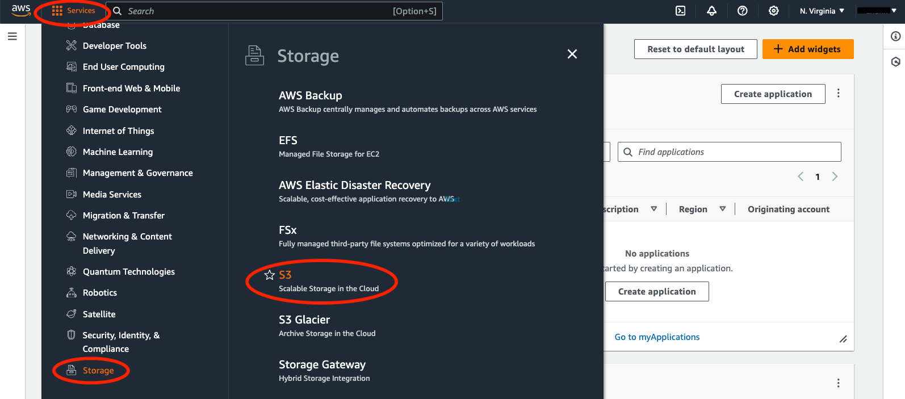

For first time user
=======
.. _set-up-aws:
AWS account 
------------
If this is your first time working with AWS, you need to set up your AWS account. You will need to provide your credit card information if you register through `normal channel <http://aws.amazon.com/>`_. But don't worry. You won't be charged until you decide to download spartan data, and the cost is less than $0.1. If you are a student, you can register through `AWS Educate program <https://aws.amazon.com/education/awseducate/>`_ without providing any credit card information and enjoy the resources for free!

.. _s3:
Using S3 & data egress charge
------------
Once your account is verified and you are signed in to your console, you can find SPARTAN data through the S3 storage under the 'Services' tab on the top left of your screen. Below is a screenshot showing the locations. 

You can either download the data (egress) or work on the data on cloud. The data egress fee on AWS is $0.09/GB with `discount for researchers <https://aws.amazon.com/blogs/publicsector/aws-offers-data-egress-discount-to-researchers/>`_. The current size for all SPARTAN data is less than 200M, so the cost of downloading is negligible. Experienced cloud users can work on the data through AWS computing services without downloading them. 

